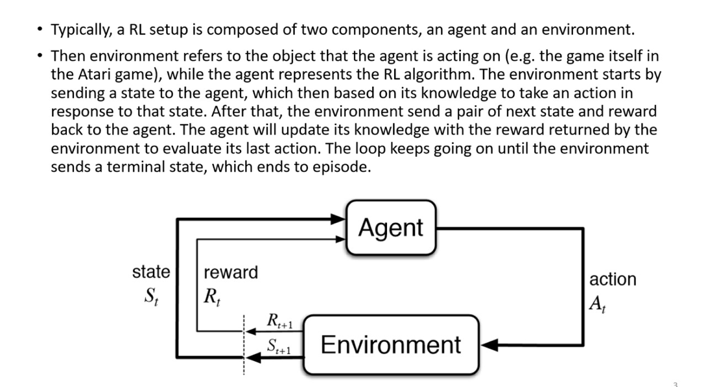
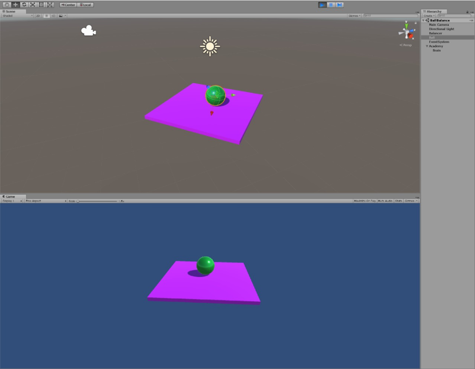

# Ball Balancer
Using TensorFlow to generate a machine learning model, and then importing it to Unity. This model is them embedded into Unity, and Unity uses the model to balance a ball in the position it’s placed on a platform which is moving erratically.

The neural network model trains agents in order to make sure that the ball is in the same position and that if the ball falls down from the platform, the game restarts. 

# Representation of the Problem

In order to balance the ball on the platform we use a reward system which rewards the agent if the conditions are met and this is known as reinforcement learning in our case.

Reinforcement learning allows us to reward the agent which will allow it to update its knowledge about the environment and the position of the ball. And to reach our goal we are using TensorFlow to train the agents and thus importing it in unity. 

# The Algorithm

Machine Learning Agents and TensorFlow model training is being used in order to train this system, in which TensorFlow is provided with the name of the unity model and various other fields which will allow us to train the Machine Learning agents.

# Data Structures & Tools
Neural Network -> Consists of the agents 

TensorFlow plug-ins for unity

Python

Unity

# Results

The ball stays in its place as the platform moves erratically and maintains its position, if it falls from the platform the game restarts. 

One of the conditions where the ball falls from the platfrom is when its placed near to the edges or the corner of the platform.

# Collaborators

[Mohammad Fawaz Siddiqi](https://github.com/fawazsiddiqi)

[Sahan Ratnayake](https://github.com/sahanratnayake)

Abu Baker 
